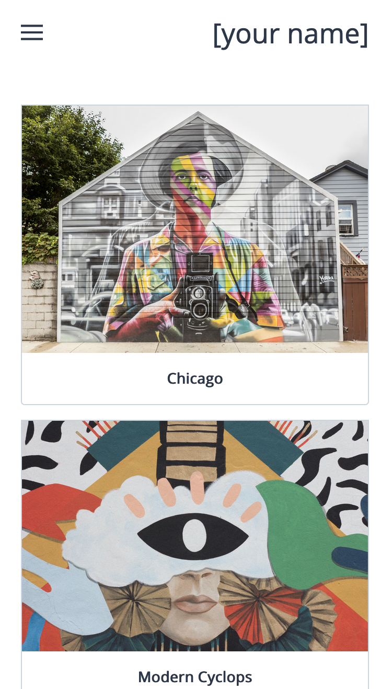
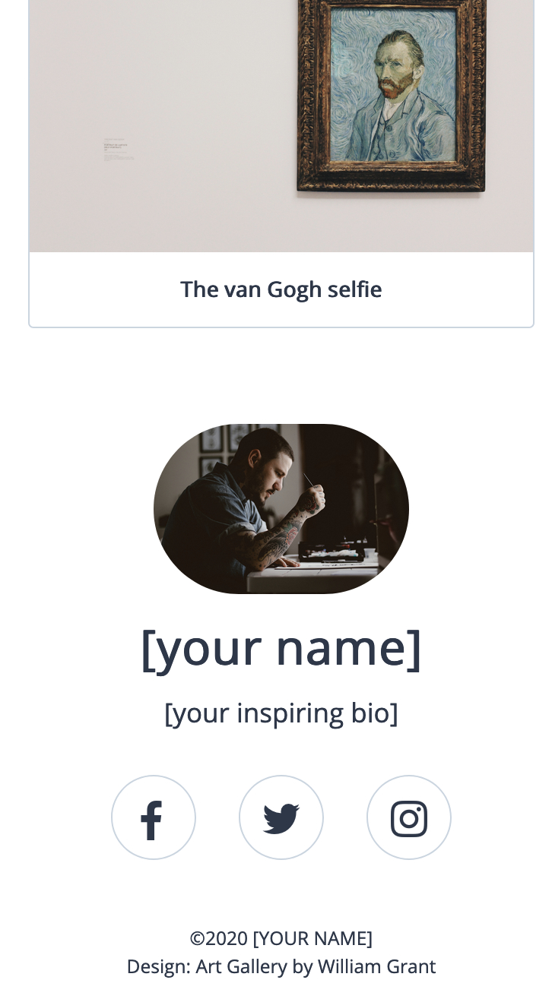
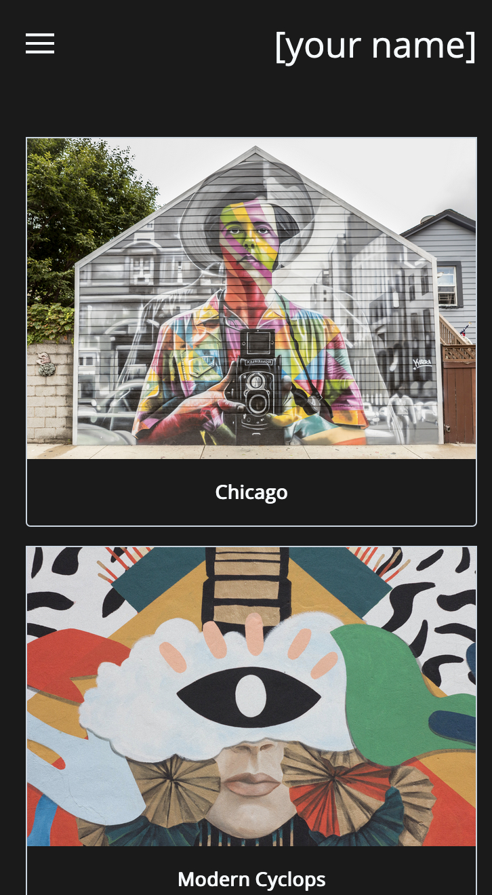
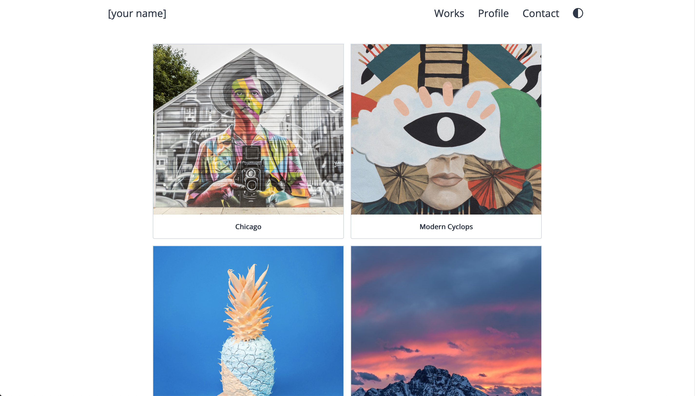
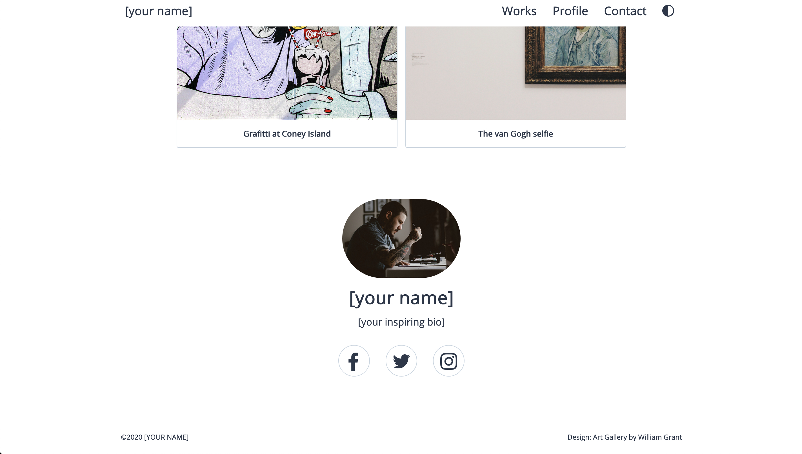
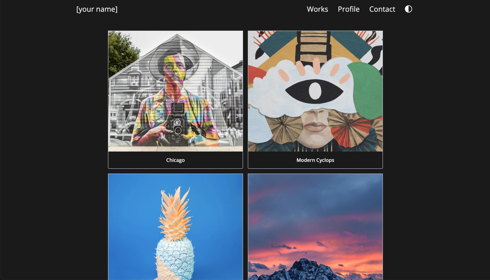

# Art Gallery

A free to use template for artists to showcase their portfolio on the web.

Please note that you will need some basic HTML knowledge to use this template.

## Features

- [x] Responsive
- [x] Minimal
- [x] Light / Dark Themes
- [x] Open source

- Click on images to enlarge them in a modal.

## Installation

1. Make sure you've installed all requirements
2. Clone this repository:
  `git clone https://github.com/yougotwill/art-gallery`
3. Or download the latest master from [here](https://github.com/yougotwill/art-gallery/archive/master.zip)

## Usage

Here's a short (imperfect) explanation on how to use `Art Gallery`:

1. Download and unzip this repository in your hosting location.
2. Open [index.html](index.html) in a text editor of your choice.
3. Replace all instances of `[your name]` with your name.
4. Replace all instances of `[your email]` with your email address.
5. Replace the `[your inspiring bio]` with a cool bio to describe yourself to the world.
6. Replace `[your username]` with your username for Facebook, Twitter and Instagram.
7. Place an avatar / profile picture and some pictures of your art inside of the [assest](assets/) folder.
8. Look for the `image-card` class and replace all the src url's in the `img` tags to your files.
9. Search for `alt="avatar"` and replace the src url with your own avatar.
10. Open [index.html](index.html) in your browser of choice and see the results.

## Screenshots

### Mobile

#### Screenshot 1

#### Screenshot 2

#### Dark theme

### Desktop

#### Screenshot 1

#### Screenshot 2

#### Dark theme

## Contributing

1. Fork it
2. Create your feature branch: `git checkout -b feature/my-new-feature`
3. Commit your changes: `git commit -am 'Add some feature'`
4. Push to the branch: `git push origin feature/my-new-feature`
5. Submit a pull request

## Requirements / Dependencies

- TailwindCSS
- Font Awesome

## Version

0.1.0

## License

[GNU GPLv3](LICENSE)

## References

### Inspiration

- [Illustfolio 4][https://sanographix.github.io/illustfolio4/]

### Photos

- [Photo by Allef Vinicius on Unsplash](https://unsplash.com/photos/P2BoE6tb8ig)
- [Photo by Matthew T Rader on Unsplash](https://unsplash.com/photos/RgicPdBNAHo)
- [Photo by Mr TT on Unsplash](https://unsplash.com/photos/xb0wLfZH9Zo)
- [Photo by davisco on Unsplash](https://unsplash.com/photos/rhUU1pemhQ0)
- [Photo by Jean-Philippe Delberghe on Unsplash](https://unsplash.com/photos/vlQnJZ5rOwY)
- [Photo by Alina Grubnyak on Unsplash](https://unsplash.com/photos/IsxaFsXi2rs)

### Dev

- [Fixed image height fix](https://stackoverflow.com/questions/12991351/css-force-image-resize-and-keep-aspect-ratio)
- [Off canvas hamburger menu](https://medium.com/@heyoka/responsive-pure-css-off-canvas-hamburger-menu-aebc8d11d793)
